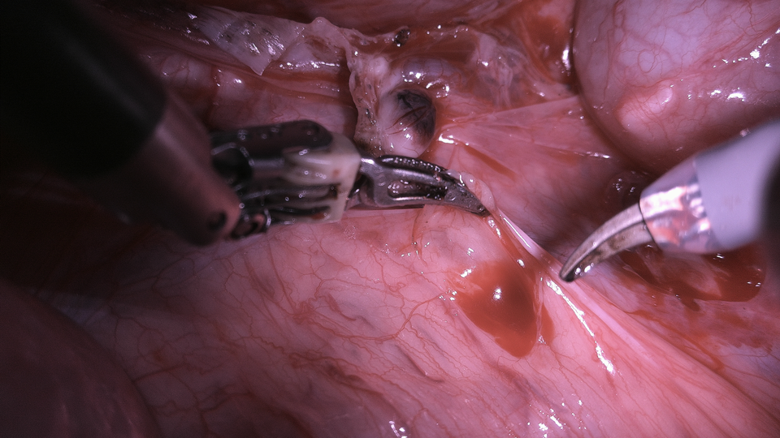
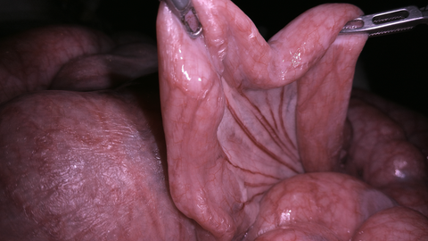
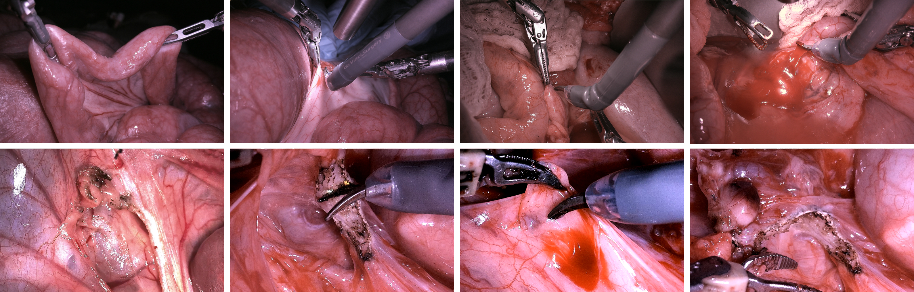

# SurgiSR4K: A High-Resolution Endoscopic Video Dataset for Robotic-Assisted Minimally Invasive Procedures

[](https://creativecommons.org/licenses/by-nc/4.0/)
[](https://arxiv.org/abs/2507.00209)

## Overview

SurgiSR4K is the first publicly accessible surgical imaging and video dataset captured at native 4K resolution (3840×2160), specifically designed for robotic-assisted minimally invasive surgery (MIS). This dataset addresses the critical need for high-resolution surgical data to advance computer vision applications in medical robotics.

**Paper**: [SurgiSR4K: A High-Resolution Endoscopic Video Dataset for Robotic-Assisted Minimally Invasive Procedures](https://arxiv.org/abs/2507.00209)

### Authors
Fengyi Jiang¹, Xiaorui Zhang¹, Lingbo Jin¹, Ruixing Liang¹'²'³, Yuxin Chen¹'⁴, Adi Chola Venkatesh¹, Jason Culman¹, Tiantian Wu⁵, Lirong Shao¹, Wenqing Sun¹, Cong Gao¹, Hallie McNamara¹, Jingpei Lu¹, Omid Mohareri¹

¹ Intuitive Surgical, Inc., Sunnyvale, CA, USA  
² Johns Hopkins Medicine Neurosurgery, Baltimore, MD, USA  
³ Johns Hopkins University Electrical and Computer Engineering, Baltimore, MD, USA  
⁴ University of British Columbia Electrical and Computer Engineering, Vancouver, BC, Canada  
⁵ Wilford & Kate Bailey Small Animal Teaching Hospital, Auburn, AL, USA


**Figure 1**: Side-by-side comparison of 1080p (top) and 4K (bottom) endoscopic images captured simultaneously with separate 1080p and 4K cameras.

## Dataset Download

**Download Link**: [https://www.synapse.org/SurgiSR4K](https://www.synapse.org/SurgiSR4K)

> **Note**: The actual dataset images and videos are hosted on Synapse. This GitHub repository contains documentation, scripts, and sample images for reference.

## Dataset Description

### Key Features
- **Native 4K Resolution**: All videos captured at 3840×2160 pixels
- **Realistic Surgical Scenarios**: Authentic robotic-assisted laparoscopic procedures
- **Diverse Challenging Conditions**: Specular reflections, tool occlusions, bleeding, smoke, tissue deformations
- **Multi-Task Support**: Designed for super resolution, instrument detection, depth estimation, segmentation, and more

## Sample Images

The following examples showcase the dataset's diversity across different resolutions and surgical tool complexities:

### High-Resolution 4K Sample (3840×2160p)


*Example of native 4K resolution frame showing complex 4-tool surgical scenario*

### Medium Resolution Sample (960×540p)


*Medium resolution frame demonstrating 2-tool procedure*

### Low Resolution Input Sample (480×270p)


*Low resolution input frame showing single tool operation*

### Resolution Comparison
| Resolution | Sample Frame | Tool Complexity | Use Case |
|------------|--------------|-----------------|----------|
| 3840×2160p | High-detail 4K | 4 tools | Ground truth for SR |
| 960×540p | Medium quality | 2 tools | Intermediate SR target |
| 480×270p | Low quality | 1 tool | SR input/baseline |

These samples demonstrate the dataset's capability to support super-resolution research with realistic surgical scenarios featuring varying numbers of instruments and different levels of procedural complexity.



**Figure 2**: Example frames from the training dataset, showcasing various tools and scenarios used in different scenarios. These frames highlight the diversity of situations included in the dataset.

## Dataset Structure

```
SurgiSR4K/
├── LICENSE                          # CC-BY-NC-4.0 license
├── README.md                        # This file
├── docs/
│   └── DATASET_ORGANIZATION.md      # Detailed organization format documentation
├── data/
│   ├── images/
│   │   ├── 3840x2160p/              # 4K resolution frames (ground truth)
│   │   ├── 960x540p/                # Medium resolution frames
│   │   └── 480x270p/                # Low resolution frames (input)
│   └── videos/
│       └── 3840x2160_30fps/         # Source 4K videos at 30 FPS
├── scripts/
│   ├── split.py                     # Dataset splitting utility
└── ...
```

### Original Organization Format

The dataset is organized by resolution and surgical tool complexity. For detailed information about the original file organization, naming conventions, and structure, see **[Dataset Organization Documentation](DATASET_ORGANIZATION.md)**.

**Quick Reference:**
- **Resolution levels**: 480×270p, 960×540p, 3840×2160p
- **Tool categories**: 1tool, 2tool, 3tool, 4tool (complexity indicators)
- **Naming pattern**: `vid_{ID}_{resolution}_{tool}_{frame}.png`
- **Total frames**: 2,400 (800 per resolution across 25 videos)

## Task Definition and Labels

### Primary Task: Super Resolution (SR)
- **Input**: Lower resolution frames (480p, 960p, 1080p)
- **Target**: Native 4K resolution frames
- **Evaluation**: PSNR, SSIM, LPIPS, and perceptual quality metrics

## Downstream Applications

Examples of downstream applications: (a) instance segmentation (Ravi et al. (2024)), (b) surgical tool detection with bounding boxes (Liu et al. (2025)), (c) depth estimation (Bochkovskii et al. (2024)), (d) tool segmentation Ravi et al. (2024), and (e) 3D reconstruction. (Hu et al. (2025))

### References
- Nikhila Ravi, Valentin Gabeur, Yuan-Ting Hu, Ronghang Hu, Chaitanya Ryali, Tengyu Ma, Haitham Khedr, Roman Rädle, Chloe Rolland, Laura Gustafson, et al. Sam 2: Segment anything in images and videos. *arXiv preprint arXiv:2408.00714*, 2024.

- Ziyu Liu, Zeyi Sun, Yuhang Zang, Xiaoyi Dong, Yuhang Cao, Haodong Duan, Dahua Lin, and Jiaqi Wang. Visual-rft: Visual reinforcement fine-tuning. *arXiv preprint arXiv:2503.01785*, 2025.

- Aleksei Bochkovskii, AmañAG¸l Delaunoy, Hugo Germain, Marcel Santos, Yichao Zhou, Stephan R Richter, and Vladlen Koltun. Depth pro: Sharp monocular metric depth in less than a second. *arXiv preprint arXiv:2410.02073*, 2024.

- Wenbo Hu, Xiangjun Gao, Xiaoyu Li, Sijie Zhao, Xiaodong Cun, Yong Zhang, Long Quan, and Ying Shan. Depthcrafter: Generating consistent long depth sequences for open-world videos. In *Proceedings of the Computer Vision and Pattern Recognition Conference*, pages 2005–2015, 2025.

## Getting Started


## Evaluation Metrics

### Super Resolution
- **PSNR**: Peak Signal-to-Noise Ratio
- **SSIM**: Structural Similarity Index
- **LPIPS**: Learned Perceptual Image Patch Similarity
- **Medical Quality**: Custom metrics for surgical video assessment

 
## Licensing and Usage

### License
This dataset is released under the **Creative Commons Attribution-NonCommercial 4.0 International (CC BY-NC 4.0)** license.

### Citation
```bibtex
@article{jiang2025surgisr4k,
  author    = {Fengyi Jiang and Xiaorui Zhang and Lingbo Jin and Ruixing Liang and Yuxin Chen and Adi Chola Venkatesh and Jason Culman and Tiantian Wu and Lirong Shao and Wenqing Sun and Cong Gao and Hallie McNamara and Jingpei Lu and Omid Mohareri},
  title     = {SurgiSR4K: A High‐Resolution Endoscopic Video Dataset for Robotic‐Assisted Minimally Invasive Procedures},
  journal   = {arXiv preprint arXiv:2507.00209},
  year      = {2025},
  volume    = {2507.00209},
  doi       = {10.48550/arXiv.2507.00209},
  url       = {https://arxiv.org/abs/2507.00209}
}

```

## Data Privacy and Ethics


## Contributing

### Reporting Issues
Please report any issues or questions via GitHub issues or contact the maintainers.

### Contributing Code
We welcome contributions to preprocessing scripts, evaluation tools, and baseline implementations.

## Acknowledgments

We thank the surgical teams, patients, and institutions that made this dataset possible. Special recognition to the robotic surgery programs that provided the clinical data.

## Contact

For questions, issues, or collaboration opportunities:
- **Primary Contact**: Fengyi Jiang (fengyi_jiang@alumni.brown.edu)

- **Dataset Inquiries**: ray.zhang@intusurg.com

## Version History

- **v1.0** (2025-07): Initial release
---

*This dataset supports research in computer vision for surgical applications. Use responsibly and cite appropriately.* 